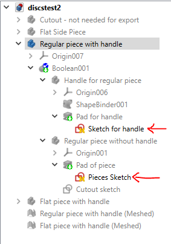
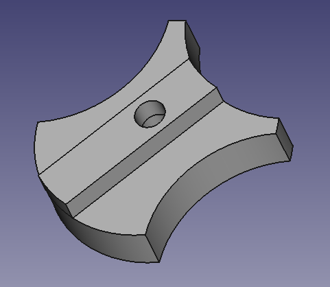
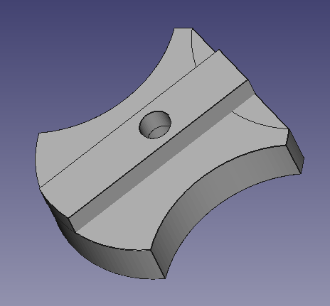
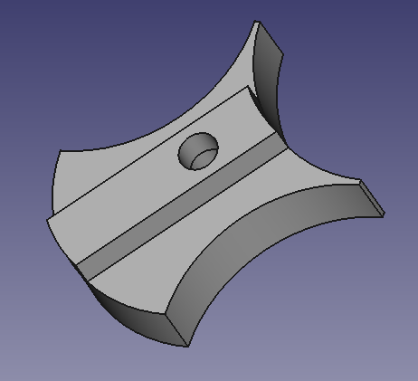
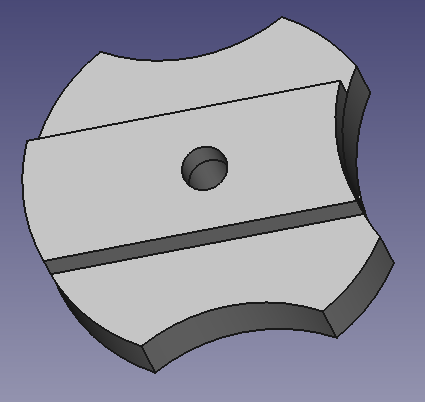

# locking-disc-puzzle
3D printable locking disc puzzle, recreation of the out of print/out of patent puzzle

The expired patent: https://patents.google.com/patent/US3637215A/en

More on this puzzle/family of puzzles from Jaap's Puzzle Page: https://www.jaapsch.net/puzzles/spinout.htm

And from Gabriel Fernandes' Puzzle Collection Page: http://mypuzzlecollection.blogspot.com/2012/09/spin-out.html

Degrees of freedom: you can edit the geometry of the pieces as well as the thickness of the handle
* To update the base shape of the pieces, locate Regular Piece with Handle > Boolean001 > Regular piece without handle > Pad of piece > Pieces Sketch
* To update the handle thickness, locate Regular piece with handle > Boolean001 > Handle for regular piece > Pad for handle > Sketch for handle

Sketches you need shown in the tree view:

To export, switch to the Mesh Workbench from the FreeCAD workbench menu, select the body to export ("Regular piece with handle" or "Flat piece with handle"), then go to Meshes > Create mesh from shape

Regular piece (original puzzle has six)

Flat piece (original puzzle has one)

Extreme geometry version, sharp

Extreme geometry version, blunt

